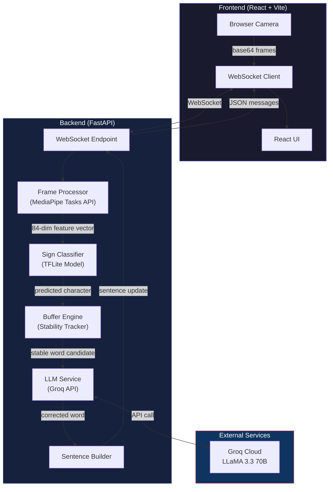
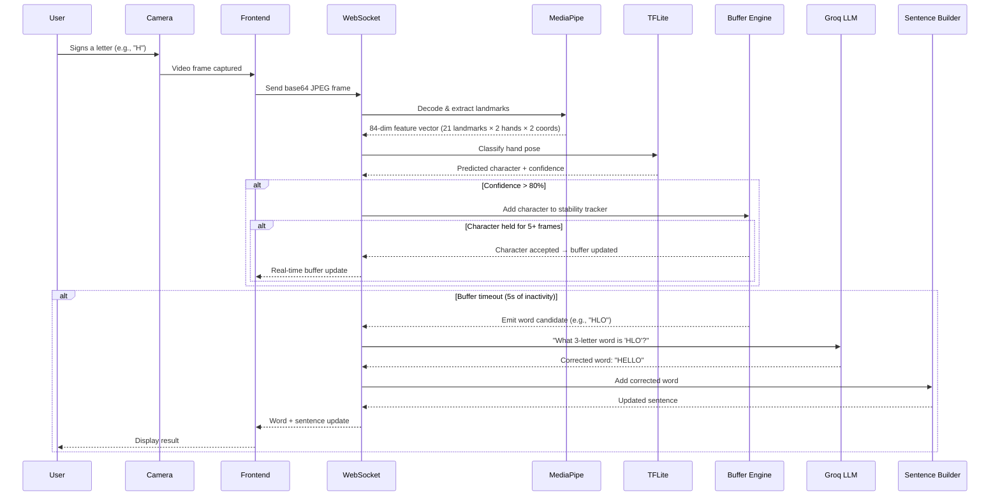

# 🤟 ISL Translator — Indian Sign Language to Text

> Real-time Indian Sign Language (ISL) finger-spelling recognition that converts hand gestures into characters, words, and sentences using AI.

[](https://python.org)
[](https://fastapi.tiangolo.com)
[](https://react.dev)
[](https://docs.docker.com/compose/)
[](LICENSE)

---

## Features

- **Real-time hand detection** — MediaPipe Tasks API with dual-hand landmark tracking
- **AI-powered character recognition** — TFLite model classifying 35 ISL signs (A–Z, 0–9)
- **Smart word correction** — Groq LLM (LLaMA 3.3 70B) corrects misread characters into real English words
- **Sentence building** — Words accumulate into grammatically refined sentences
- **WebSocket streaming** — Low-latency bidirectional communication (~10ms)
- **Stability buffering** — Requires consistent sign holds to avoid false positives
- **Premium dark-themed UI** — Glassmorphism, gradients, and micro-animations

---

## Architecture



---

## Data Flow



---

## 🛠️ Tech Stack

| Layer | Technology | Purpose |
|-------|-----------|---------|
| **Frontend** | React 19, Vite 8 | UI with camera feed and live updates |
| **Backend** | FastAPI, Uvicorn | WebSocket server + REST health check |
| **Hand Detection** | MediaPipe Tasks API | Dual-hand landmark extraction (21 points/hand) |
| **Sign Classification** | TensorFlow Lite | Lightweight inference (35 ISL signs) |
| **Word Correction** | Groq API (LLaMA 3.3 70B) | AI-powered spelling correction |
| **Containerisation** | Docker, Docker Compose | Multi-service orchestration |
| **Reverse Proxy** | Nginx | Serves frontend with gzip + caching |

---

## 🚀 Quick Start

### Prerequisites

- [Docker Desktop](https://www.docker.com/products/docker-desktop/) (v20+)
- A free [Groq API key](https://console.groq.com/) (for LLM word correction)

---

### 1. To Run with Docker Compose (Recommended)

> For the complete Docker setup with detailed steps, troubleshooting, and useful commands, refer to the **[Docker Setup Guide](docs/DOCKER_SETUP.md)**.

### 2. To Run Locally (Without Docker)

#### Backend

```bash
cd backend

# Create a virtual environment
python -m venv venv

# Activate it
# Windows:
venv\Scripts\activate
# Linux/macOS:
source venv/bin/activate

# Install dependencies
pip install -e .

# Download the MediaPipe model (if not already done)
# Windows (PowerShell):
Invoke-WebRequest -Uri "https://storage.googleapis.com/mediapipe-models/hand_landmarker/hand_landmarker/float16/1/hand_landmarker.task" -OutFile "model/hand_landmarker.task"
# Linux/macOS:
curl -L -o model/hand_landmarker.task "https://storage.googleapis.com/mediapipe-models/hand_landmarker/hand_landmarker/float16/1/hand_landmarker.task"

# Set up environment variables
cp .env.example .env
# Edit .env and add your GROQ_API_KEY

# Start the backend
uvicorn app.main:app --host 0.0.0.0 --port 8000 --reload
```

#### Frontend

```bash
cd frontend

# Install dependencies
npm install

# Start the dev server
npm run dev
```

The frontend will be available at http://localhost:5173

---

## ⚙️ Environment Variables

| Variable | Default | Description |
|----------|---------|-------------|
| `GROQ_API_KEY` | *(required)* | Your Groq API key for LLM word correction |
| `GROQ_MODEL` | `llama-3.3-70b-versatile` | Groq model to use |
| `CORS_ORIGINS` | `http://localhost:5173` | Allowed CORS origins (comma-separated) |
| `MODEL_PATH` | `model/isl_model_2hand.tflite` | Path to TFLite sign classification model |
| `LABELS_PATH` | `model/labels_2hand.json` | Path to label map JSON |
| `STABILITY_FRAMES` | `5` | Frames a character must be held to be accepted |
| `BUFFER_TIMEOUT_SECONDS` | `5.0` | Seconds of inactivity before emitting a word |
| `MIN_BUFFER_SIZE` | `3` | Minimum characters required to form a word |
| `CONFIDENCE_THRESHOLD` | `80.0` | Minimum prediction confidence (%) |
| `HOST` | `0.0.0.0` | Server bind address |
| `PORT` | `8000` | Server port |
| `LOG_LEVEL` | `info` | Logging level |

---

## 📁 Project Structure

```
ISL/
├── backend/                     # FastAPI backend
│   ├── app/
│   │   ├── api/
│   │   │   └── websocket.py     # WebSocket endpoint (per-session state)
│   │   ├── core/
│   │   │   ├── buffer_engine.py  # Character stability + word emission
│   │   │   ├── frame_processor.py# MediaPipe hand landmark extraction
│   │   │   ├── llm_service.py    # Groq API for word correction
│   │   │   ├── sentence_builder.py# Word → sentence accumulation
│   │   │   └── sign_classifier.py# TFLite model inference
│   │   ├── models/
│   │   │   └── schemas.py        # Pydantic message schemas
│   │   ├── utils/
│   │   │   └── logging.py        # Structured logging
│   │   ├── config.py             # Pydantic Settings (env-based config)
│   │   └── main.py               # FastAPI app factory + lifespan
│   ├── model/
│   │   ├── isl_model_2hand.tflite# Sign classification model
│   │   ├── labels_2hand.json     # 35-class label map
│   │   └── hand_landmarker.task  # MediaPipe hand model (download required)
│   ├── tests/                    # Pytest test suite
│   ├── Dockerfile                # Multi-stage backend image
│   ├── pyproject.toml            # Python dependencies
│   └── .env.example              # Environment variable template
│
├── frontend/                     # React + Vite frontend
│   ├── src/
│   │   ├── components/
│   │   │   ├── CameraFeed.jsx    # Live video with detection overlay
│   │   │   ├── ControlPanel.jsx  # Start/Stop/Clear buttons
│   │   │   ├── LiveBuffer.jsx    # Character tiles + stability bar
│   │   │   ├── SentenceDisplay.jsx# AI-refined sentence output
│   │   │   ├── StatusIndicator.jsx# Connection status
│   │   │   └── WordHistory.jsx   # Scrollable word corrections
│   │   ├── hooks/
│   │   │   ├── useCamera.js      # Camera lifecycle hook
│   │   │   └── useWebSocket.js   # Auto-reconnect WebSocket hook
│   │   ├── App.jsx               # Root component
│   │   └── index.css             # Premium dark theme
│   ├── Dockerfile                # Multi-stage frontend image (Node → Nginx)
│   ├── nginx.conf                # Nginx config with gzip + caching
│   └── package.json              # Node dependencies
│
├── infrastructure/
│   └── docker-compose.yml        # Local dev orchestration
│
├── scripts/
│   └── convert_model.py          # Convert .h5 → .tflite (one-time utility)
│
├── .env.example                  # Root env template
├── .gitignore
├── LICENSE                       # MIT
└── README.md                     # ← You are here
```

---

## 🧪 Running Tests

```bash
cd backend
pip install -e ".[dev]"
pytest -v
```

---

## 📝 License

This project is licensed under the [MIT License](LICENSE).

---

## Acknowledgements

- [MediaPipe](https://ai.google.dev/edge/mediapipe/solutions/guide) — Hand landmark detection
- [Groq](https://groq.com/) — Ultra-fast LLM inference
- [TensorFlow Lite](https://www.tensorflow.org/lite) — Lightweight model inference
